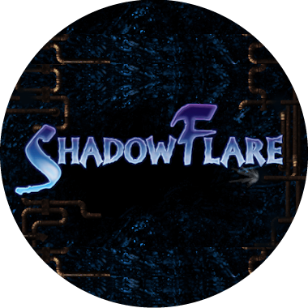

<!-- SPDX-License-Identifier: CC-BY-SA-4.0 -->
<!-- SPDX-FileCopyrightText: 2023-2026 Michael Binder and OpenShadowFlare contributors -->

# OpenShadowFlare



OpenShadowFlare is a community effort to preserve and rebuild ShadowFlare, a
great little action RPG from the early 2000s that deserves to be playable for
a long time yet.

Right now, we are carefully reconstructing the support DLLs used by the
original game. The goal is to match their original behavior as closely as we
can before moving on to `ShadowFlare.exe` itself. Modern features such as
widescreen support and native builds can come later, first we want a solid,
faithful foundation.

[](https://discord.gg/4F2dMu5qwQ)

## Table of Contents

- [Introduction](#introduction)
- [ShadowFlare game files](#shadowflare-game-files)
- [Current state](#current-state)
- [Prebuilt binaries](#prebuilt-binaries)
- [Building from source](#building-from-source)
- [Running the tests](#running-the-tests)
- [Contributing](#contributing)
- [License](#license)

## Introduction

ShadowFlare was developed by Denyusha and released in Japan in 2001, followed
by an international release in 2002. It grew into a four-episode action RPG,
with the first episode later offered as shareware.

The official site eventually disappeared, the game never made its way to
stores such as Steam or GOG, and running it on a modern system has become
increasingly awkward. That's why we're here.

OpenShadowFlare is not a remake with different rules or a reimagining of the
game. We are studying how the original worked and rebuilding it piece by piece.
For now, that means reproducing all fourteen DLLs while keeping their exported
functions, data formats, and behavior compatible with the original game.

This is a work in progress, and there is still plenty left to understand. If
you enjoy old games, reverse engineering, graphics, audio, networking, or
simply careful detective work, you are very welcome here.

## ShadowFlare game files

OpenShadowFlare uses the original ShadowFlare assets. We cannot include or
distribute those files, so you will need your own copy of the game.

For local development, the game is expected in:

```text
tmp/ShadowFlare/
```

When reconstructed DLLs are deployed, the build script keeps each original DLL
as `o_<name>.dll`. The test suite uses those copies to compare our work with
the real thing.

## Current state

Here's where things stand today:

- All 763 exported DLL names and ordinals are reproduced and checked
  automatically.
- All fourteen DLLs can now run without loading an original ShadowFlare DLL.
- The table, AI, scenario, and generated-font formats are tested with real game
  data, including byte-for-byte writeback checks where possible.
- Original and reconstructed DLLs can be run side by side through differential
  probes under Wine.
- An isolated smoke test confirms that the reconstructed DLL set starts the
  game and reaches its render loop.

That completes the first big reconstruction milestone: the whole support-DLL
layer is ours. It does not mean every obscure code path is proven perfect yet.
Audio timing, uncommon drawing modes, authenticated multiplayer, and some
in-game map/rendering combinations still need broader testing. The next major
piece is `ShadowFlare.exe` itself.

For the nitty-gritty, see the [fidelity inventory](fidelity/README.md). The
[roadmap](roadmap.md) shows what we're planning to tackle next.

## Prebuilt binaries

We do not publish official prebuilt releases yet. The reconstruction is moving
quickly, and building locally makes it much easier to know exactly which source
and DLL versions are being tested together.

For now, use the build instructions below.

## Building from source

The supported build currently runs on Linux and cross-compiles 32-bit Windows
DLLs with MinGW-w64.

On Debian or Ubuntu, install the compiler with:

```bash
sudo apt install mingw-w64
```

Then build all fourteen DLLs:

```bash
./src/build.sh
```

The resulting files are placed in `src/build-win32/`.

To copy them into the local game directory:

```bash
./src/build.sh --deploy
```

The first deployment renames the original DLLs to `o_<name>.dll`. Existing
backups are never overwritten by later deployments.

You can then start the game through Wine:

```bash
./run-shadowflare.sh
```

Native Linux and macOS builds are not available yet, and the project does not
currently use CMake.

## Running the tests

Run the build and static ABI/fidelity checks with:

```bash
./tests/run.sh
```

If Wine is installed, you can also run the original-vs-reconstructed
differential probes and the game smoke test:

```bash
./tests/run.sh --wine
```

The Wine smoke test works in a temporary copy of the game directory. It does
not replace files in your local installation.

## Contributing

OpenShadowFlare is a community project made by people who care about the game.
You do not need to be a reverse-engineering expert to help: testing, code
cleanup, documentation, data-format research, and careful bug reports are all
valuable.

If you would like to join in, have a look at the
[contribution guidelines](readme/CONTRIBUTING.md) or come chat with us on
[Discord](https://discord.gg/4F2dMu5qwQ).

## License

OpenShadowFlare is a share-alike project:

- Code is licensed under the
  [GNU General Public License v3 or later](LICENSE). If you distribute a
  modified build or derivative, its recipients must get the corresponding
  source code under the GPL too.
- Written documentation and reverse-engineering research are licensed
  under
  [Creative Commons Attribution-ShareAlike 4.0](LICENSES/CC-BY-SA-4.0.txt).
  Shared adaptations must credit OpenShadowFlare and stay under the same
  license.

There is an unavoidable legal limit: copyright does not cover bare facts,
ideas, or knowledge. Someone independently using a file-format fact from our
research may not be creating a licensed derivative. We still ask everyone who
benefits from this work to credit the project and share what they learn — that
is the community this project is here to build.

The full scope, attribution guidance, exclusions, and earlier MIT history are
explained in [LICENSING.md](LICENSING.md).

ShadowFlare, its original binaries, assets, names, and trademarks are not
licensed by this project. OpenShadowFlare is an independent preservation
project and is not affiliated or endorsed by the original developers or publishers.
