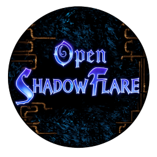

<!-- SPDX-License-Identifier: CC-BY-SA-4.0 -->
<!-- SPDX-FileCopyrightText: 2023-2026 Michael Binder and OpenShadowFlare contributors -->

# OpenShadowFlare



OpenShadowFlare is a community effort to preserve and rebuild ShadowFlare, a
great little action RPG from the early 2000s that deserves to be playable for
a long time yet.

We started by reconstructing all fourteen support DLLs used by the original
game. With that foundation in place, the main work is now a faithful,
cross-platform reconstruction of `ShadowFlare.exe`. Modern extras such as
widescreen support can come later; first we want the original game working
properly.

[](https://discord.gg/4F2dMu5qwQ)

Want to see the latest progress? You can
[try the recent development build in your browser](https://rednibcoding.github.io/OpenShadowFlare/).
It uses your own ShadowFlare game files locally; they are not uploaded.

Just keep in mind that this is a live development build, not a finished
release. Things may still be incomplete or occasionally break. If you run
into a bug, please tell us on
[GitHub](https://github.com/RednibCoding/OpenShadowFlare/issues) or Discord so
we can look into it.

While testing in-game, press `F12` for the debug menu. It can show the FPS and
[runtime profiling numbers](documentation/profiling.md), temporarily unlock
every spell, and provide infinite HP or MP, which is handy for checking the
parts that are currently being reconstructed. These debug switches do not
grant spell progress or replace the saved resource values in your character.

## Table of Contents

- [Introduction](#introduction)
- [ShadowFlare game files](#shadowflare-game-files)
- [Current state](#current-state)
- [Roadmap](#roadmap)
- [Reverse-engineering material](#reverse-engineering-material)
- [Prebuilt binaries](#prebuilt-binaries)
- [Building from source](#building-from-source)
- [Running the tests](#running-the-tests)
- [Contributing](#contributing)
- [License](#license)

## Introduction

ShadowFlare was developed by Denyusha and released in Japan in 2001, followed
by an international release in 2002. It grew into a four-episode action RPG,
with the first episode later offered as shareware.

The official site eventually disappeared, the game never made its way to
stores such as Steam or GOG, and running it on a modern system has become
increasingly awkward. That's why we're here.

OpenShadowFlare is not a remake with different rules or a reimagining of the
game. We are studying how the original worked and rebuilding it piece by piece.
The fourteen compatibility DLLs came first; now their tested behavior is being
brought into a clean portable reconstruction of the main executable.

This is a work in progress, and there is still plenty left to understand. If
you enjoy old games, reverse engineering, graphics, audio, networking, or
simply careful detective work, you are very welcome here.

## ShadowFlare game files

OpenShadowFlare uses the original ShadowFlare assets. We cannot include or
distribute those files, so you will need your own copy of the game.

For local development, the game is expected in:

```text
tmp/ShadowFlare/
```

When reconstructed DLLs are deployed, the build script keeps each original DLL
as `o_<name>.dll`. The test suite uses those copies to compare our work with
the real thing.

## Current state

Here's where things stand today:

- All 763 exported DLL names and ordinals are reproduced and checked
  automatically.
- All fourteen DLLs can now run without loading an original ShadowFlare DLL.
- The table, AI, scenario, and generated-font formats are tested with real game
  data, including byte-for-byte writeback checks where possible.
- Original and reconstructed DLLs can be run side by side through differential
  probes under Wine.
- An isolated smoke test confirms that the reconstructed DLL set starts the
  game and reaches its render loop.
- The portable executable now has a backend-neutral `gapi` graphics layer with
  a fast software renderer, plus LWL, LGL, and LAL for the window, presentation,
  and audio. It shows the working title and complete character pre-game flow,
  including creation, save previews, deletion, and the original online/single
  mode menus. Starting a single-player game now brings up the original loading
  screen and enters Remote Town with the player on the decoded retail ground
  map. Remote Town's original gates, walls, trees, rocks, and semi-transparent
  shadows are decoded from its object map and depth-sorted around the player.
  Player walking and running, retail obstacle steering, all seven town people,
  script-driven conversations and item drops, the HUD, inventory, equipment,
  belt, Special Item window, Map, Mission List, Settings, and the first
  type-zero services are working too. The Warehouse now opens the shared
  Special Item owner, the Tower of Ordeal Giant Warehouse keeps its ten real
  saved pages, and Remote Town's transport object reads its
  destination from the retail table. The world loader is no longer tied to
  scenario zero either: the Wasteland of Pillars fixture now proves the same
  data and resource path with a nonzero retail scenario and entry. Live
  scenario travel is working now as well: walking through Remote Town's real
  south-gate trigger loads `Near the Remote Town`, and the matching outdoor
  trigger brings the player back. The first outdoor goblin combat pass and
  broader scenario progression come next.

That completes the first big reconstruction milestone: the whole support-DLL
layer is ours. It does not mean every obscure code path is proven perfect yet.
Audio timing, uncommon drawing modes, authenticated multiplayer, and some
in-game map/rendering combinations still need broader testing. The current
major task is reconstructing the rest of `ShadowFlare.exe`.

For the DLL details, see the [fidelity inventory](fidelity/README.md).

## Roadmap

The [project roadmap](roadmap.md) is our working guide for the executable
reconstruction. It explains what is already finished, what the current
gameplay slice is teaching us, and how the later work builds toward combat,
save compatibility, all four episodes, and multiplayer.

It is a living plan rather than a promised schedule. We update it as the retail
game teaches us more.

The [script-engine notes](documentation/script-engine.md) document how compiled
scenario scripts are structured, how the portable interpreter is split from
the game world, and which commands have been recovered so far.

If you are working on a new desktop, mobile, web, or console target, read the
[platform porting guide](documentation/adding-platforms.md) before adding SDK
code or build settings.

## Reverse-engineering material

Ghidra output, radare2 and Remina projects, executable address maps, and older
research now live together in [`reverse/`](reverse/README.md). The folder's
index explains what each project is for and how much confidence to place in
it.

The older SDL2/C reconstruction under `reverse/references/` has useful work on
map transitions, combat, teleporting, and other systems. It is incomplete and
not always faithful, so we use it to find leads and then verify those leads
against the retail game before bringing them into the current code.

## Prebuilt binaries

We do not publish official prebuilt releases yet. The reconstruction is moving
quickly, and building locally makes it much easier to know exactly which source
and DLL versions are being tested together.

For now, use the build instructions below.

## Building from source

There are two builds at the moment: the compatibility DLLs used by the retail
game, and the new portable executable foundation.

All generated files stay under `build/<target>/<configuration>/`:

```text
build/
  dlls/debug/       reconstructed compatibility DLLs
  dlls/release/
  linux/debug/      native portable executable and tests
  linux/release/
  tests/debug/      generated differential-test programs
  tests/release/
  wasm/debug/       browser build
  wasm/release/
```

Other platforms follow the same layout, such as `build/windows/debug` or
`build/android/release`. Build folders are disposable and are not committed.

### Compatibility DLLs

The DLL build runs on Linux and cross-compiles 32-bit Windows DLLs with
MinGW-w64.

On Debian or Ubuntu, install the compiler with:

```bash
sudo apt install mingw-w64
```

Then build all fourteen DLLs. Release is the default:

```bash
./src/build.sh
./src/build.sh --config debug
```

The resulting files are placed in `build/dlls/release/` or
`build/dlls/debug/`.

To copy them into the local game directory:

```bash
./src/build.sh --config release --deploy
```

The first deployment renames the original DLLs to `o_<name>.dll`. Existing
backups are never overwritten by later deployments.

You can then start the game through Wine:

```bash
./run-shadowflare.sh
```

### Portable executable

The new executable uses CMake. The normal Linux development build lives in
`build/linux/debug`:

```bash
cmake -S . -B build/linux/debug -DCMAKE_BUILD_TYPE=Debug
cmake --build build/linux/debug
./build/linux/debug/src/SF_EXE/ShadowFlare_rebuilt
```

Use `build/linux/release` with `-DCMAKE_BUILD_TYPE=Release` for a release
build. Windows and macOS use the same pattern with their platform name.

Linux and Windows builds are established. LWL and LAL also include macOS
backends, though the new executable still needs to be built and exercised on
real macOS hardware. The executable finds the original data under
`tmp/ShadowFlare` relative to its own location, so it can also be started
directly from a file manager without relying on the current working directory.

Portable versions of DLL behavior live in `src/SF_EXE/libs`, one directory per
original DLL. They are clean static libraries rather than dependencies on the
Win32 DLL binaries. The tested compatibility reconstructions live separately
in `src/reconstructed` and remain the reference as their behavior is brought
into the portable executable piece by piece.

### Web (WebAssembly) build

Install Emscripten with [emsdk](https://github.com/emscripten-core/emsdk)
(`./emsdk install latest && ./emsdk activate latest`);

```bash
emcmake cmake -S . -B build/wasm/release \
  -DCMAKE_BUILD_TYPE=Release -DBUILD_TESTING=OFF
cmake --build build/wasm/release
```

The build writes `ShadowFlare_rebuilt.js`, `ShadowFlare_rebuilt.wasm`, and a
browser shell `index.html` into `build/wasm/release/src/SF_EXE/`. Serve that
directory with any static web server and open the page:

```bash
python -m http.server 8080 --directory build/wasm/release/src/SF_EXE
```

For an unoptimized browser build with debug information, use
`build/wasm/debug` and `-DCMAKE_BUILD_TYPE=Debug`.

The `Build and deploy WebAssembly` GitHub Actions workflow rebuilds the
release target on every push to `master`, combines it with the page in
`gh-pages/`, and publishes the result through GitHub Pages. The repository's
Pages source must be set to **GitHub Actions** once under Settings → Pages.
The same deployment can also be started manually from the Actions tab.

## Running the tests

Run the build and static ABI/fidelity checks with:

```bash
./tests/run.sh
```

For the portable libraries and executable:

```bash
cmake -S . -B build/linux/debug -DCMAKE_BUILD_TYPE=Debug
cmake --build build/linux/debug
ctest --test-dir build/linux/debug --output-on-failure
./build/linux/debug/src/SF_EXE/ShadowFlare_rebuilt --smoke-test
```

If Wine is installed, you can also run the original-vs-reconstructed
differential probes and the game smoke test:

```bash
./tests/run.sh --wine
```

The compatibility tests use release DLLs by default. Pass
`--config debug` to build and test `build/dlls/debug` instead.

The Wine smoke test works in a temporary copy of the game directory. It does
not replace files in your local installation.

## Contributing

OpenShadowFlare is a community project made by people who care about the game.
You do not need to be a reverse-engineering expert to help: testing, code
cleanup, documentation, data-format research, and careful bug reports are all
valuable.

If you would like to join in, have a look at the
[contribution guidelines](readme/CONTRIBUTING.md) or come chat with us on
[Discord](https://discord.gg/4F2dMu5qwQ).

## License

OpenShadowFlare is a share-alike project:

- Code is licensed under the
  [GNU General Public License v3 or later](LICENSE). If you distribute a
  modified build or derivative, its recipients must get the corresponding
  source code under the GPL too.
- Written documentation and reverse-engineering research are licensed
  under
  [Creative Commons Attribution-ShareAlike 4.0](LICENSES/CC-BY-SA-4.0.txt).
  Shared adaptations must credit OpenShadowFlare and stay under the same
  license.

There is an unavoidable legal limit: copyright does not cover bare facts,
ideas, or knowledge. Someone independently using a file-format fact from our
research may not be creating a licensed derivative. We still ask everyone who
benefits from this work to credit the project and share what they learn — that
is the community this project is here to build.

The full scope, attribution guidance and exclusions are
explained in [LICENSING.md](LICENSING.md).

ShadowFlare, its original binaries, assets, names, and trademarks are not
licensed by this project. OpenShadowFlare is an independent preservation
project and is not affiliated or endorsed by the original developers or publishers.
